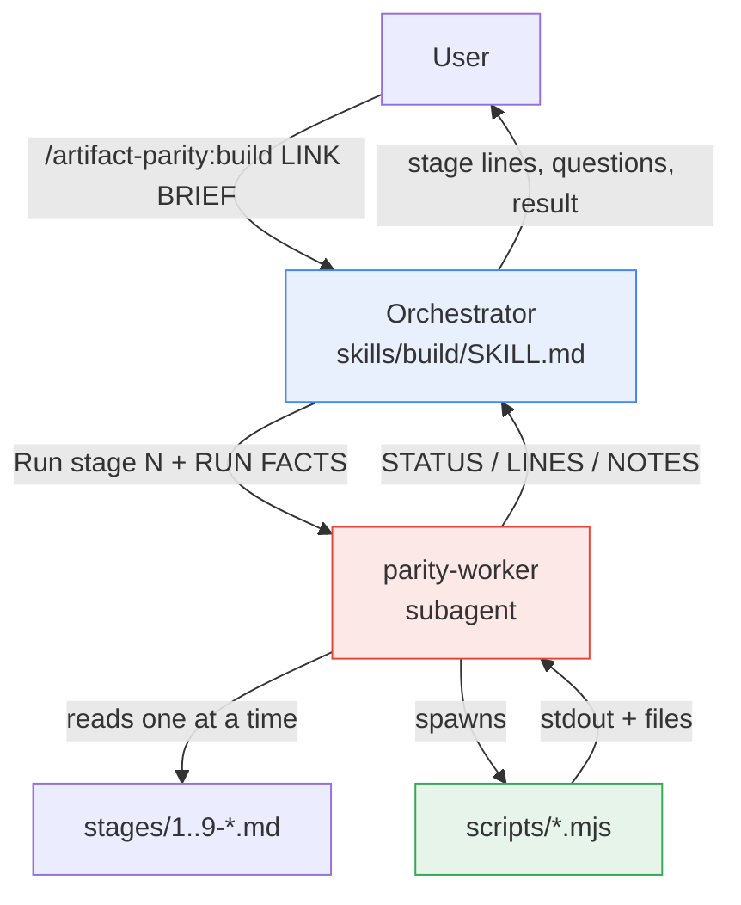
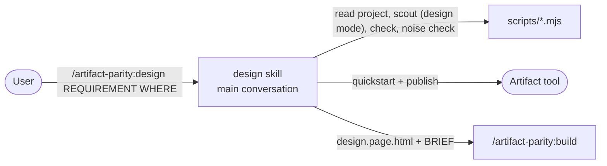
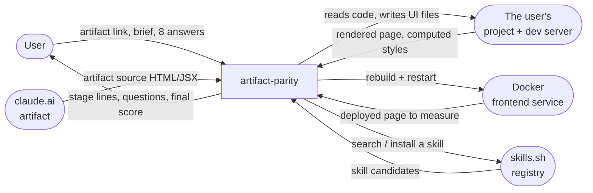
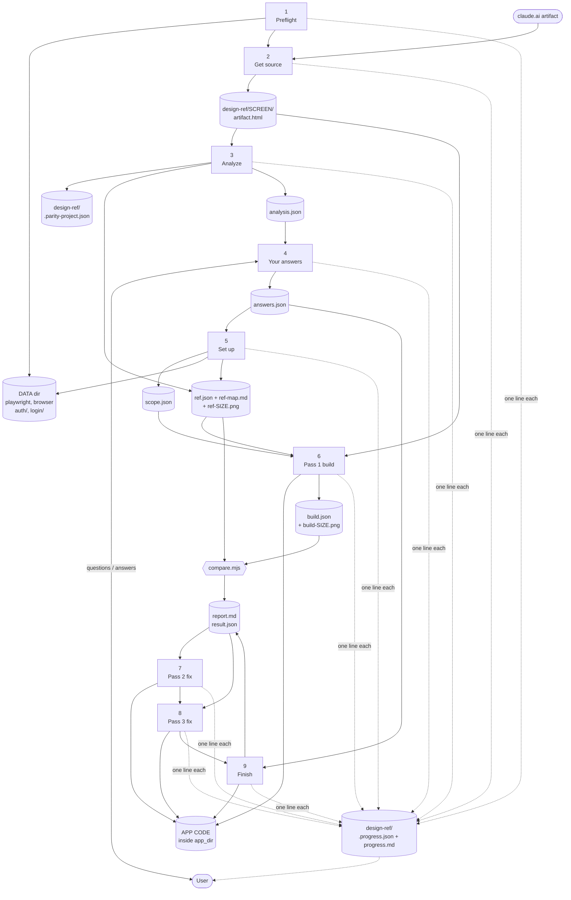
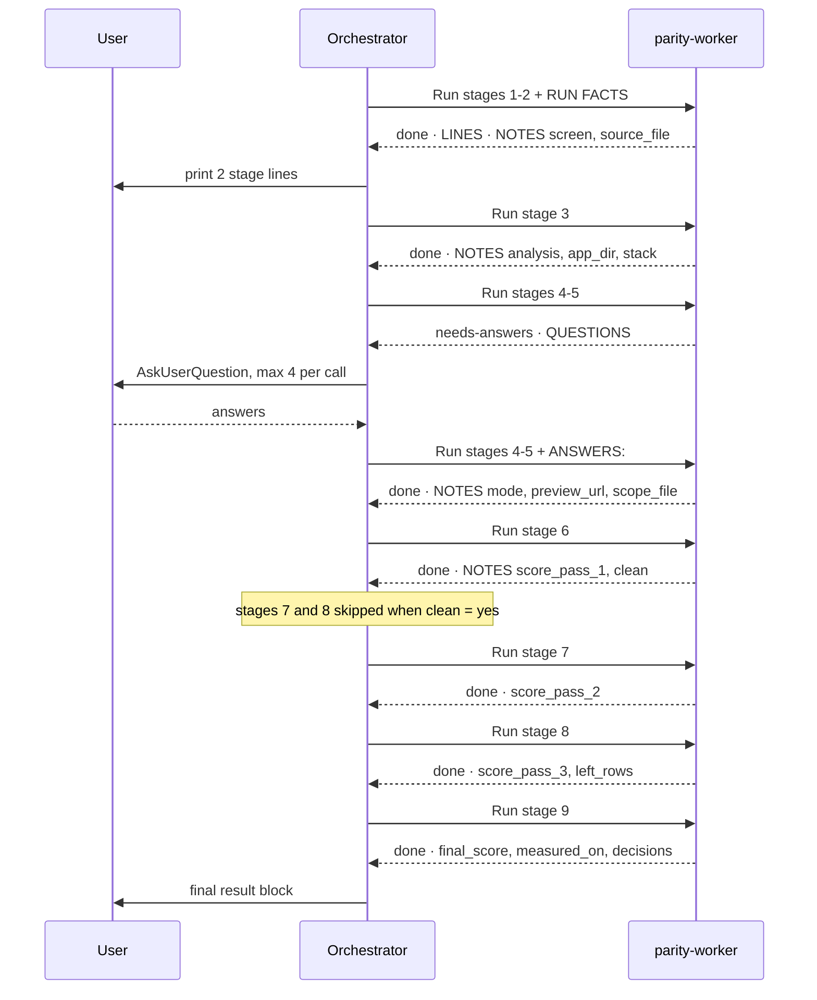

# Architecture

How `artifact-parity` is put together, what flows between its parts, and the exact shape of every file
they pass to each other.

Read [DECISIONS.md](DECISIONS.md) for *why* it is built this way.

---

## 1. The three layers

| Layer | What it is | Runs | Lives in |
|---|---|---|---|
| **Orchestrator** | A skill. Prints stage lines, asks the questions, keeps `RUN FACTS`. Does no work. | In the user's conversation | `skills/build/SKILL.md` |
| **Worker** | A subagent. Reads one stage file at a time and carries it out. | In its own context, out of sight | `agents/parity-worker.md` + `skills/build/stages/*.md` |
| **Scripts** | Node. Browser rendering, measurement, diffing, filesystem and git state. | Child processes | `scripts/*.mjs` |

The split exists to protect the user's context window: a full artifact source, a `ref.json` of every
computed style, and nine stages of command output would fill it many times over. The user sees about
nine lines.



**Why the worker and not the orchestrator:** everything the orchestrator touches stays in the user's
conversation forever. Everything the worker touches is discarded when it returns. So the rule is
absolute — the orchestrator reads no files and runs no commands.

### The design command and the skills offer

`/artifact-parity:design` (`skills/design/SKILL.md`) is the one exception to the split: it runs in the
user's conversation, because designing is a conversation (a direction, feedback, republishing to the
same link) and the Artifact tool only publishes to an artifact the current conversation has read or
published (D18). It uses the same scripts and the same printer (`progress.mjs --run design`, 6 stages),
writes only to `design-ref/_designs/<slug>/`, and ends by invoking the build with the local file and a
fixed-shape BRIEF. A whole-app design holds every screen in one artifact; it is checked screen by screen
(`progress.mjs done 5 --from-reports`) and built with one build per screen (D18 note).



The recommended skills are offered by a SessionStart hook (`hooks/hooks.json` →
`skills-offer.mjs --hook`), which only tells Claude what is missing; the installing is done by
`/artifact-parity:skills` after the user picks (D19).

---

## 2. Data flow diagram — Level 0 (context)



**Trust boundaries.** The plugin writes only into the project's frontend app folder and `design-ref/`.
It never writes to the backend, CI, Dockerfiles or env files. `scope-guard.mjs` proves this with git.

---

## 3. Data flow diagram — Level 1 (the nine stages)

Processes are numbered as the stages are. Cylinders are data stores.



**The loop that matters.** Stages 6, 7 and 8 are the same loop: change code → `capture.mjs --mode build`
→ `compare.mjs` → `report.md`. The only differences are that pass 1 builds from the artifact while
passes 2 and 3 read only `report.md`, and pass 3 also writes image crops.

---

## 4. Orchestrator ↔ worker protocol

Seven worker calls per run. The orchestrator carries a `RUN FACTS` block of at most 15 lines between
them — that block is the run's entire memory, because each worker call starts with a fresh context.



### The worker's reply format

Fixed, and nothing else is allowed:

```
STATUS: done | needs-answers | needs-user | failed
LINES:      <progress.mjs output, verbatim, one per line>
NOTES:      <key: value lines the next stages need>
QUESTIONS:  <only for needs-answers>
QUESTION:   <only for needs-user>
REASON:     <only for failed>
```

| STATUS | Meaning | Orchestrator does |
|---|---|---|
| `done` | Stage finished | Update RUN FACTS, make the next call |
| `needs-answers` | Stage 4, first call | Ask all questions, call 4-5 again with `ANSWERS:` |
| `needs-user` | A blocker after stage 4 — rare | Ask the one question, re-call the same stage with `USER ANSWER:` |
| `failed` | Cannot continue | Print `REASON`, stop. Never work around it. |

---

## 5. The scripts

Twelve scripts. `progress.mjs` verifies all of them at preflight; a missing one stops the run before
anything is built.

| Script | Does | Exit codes |
|---|---|---|
| `progress.mjs` | The only writer of user-visible run status. Prints one fixed line per call, keeps `.progress.json`, appends `progress.md`. Also the preflight gate. `--run design` starts a 6-stage design run; a build (the default) has 9 stages. | 0 ok · 1 preflight failed · 2 usage |
| `setup.mjs` | Installs Playwright + pngjs + pixelmatch and a browser into the **plugin data folder**. Falls back to installed Edge or Chrome when the download is blocked. | 0 ready · 1 failed |
| `fetch-public.mjs` | Opens a claude.ai link in a real browser, finds the artifact's sandboxed frame, saves its **original** document; falls back to the rendered DOM and says so. | 0 saved · 1 no source · 2 usage |
| `check-source.mjs` | Decides whether a file is real artifact source rather than a summary, a login shell or an empty download. Reports fonts, scripts, keyframes; warns on garbled characters and names techniques the check cannot measure (`⚠ not measured by the parity check: ...`). | 0 real · 1 not real · 2 usage |
| `detect-project.mjs` | Finds the app folder, framework, dev command and port, and the Docker service and URL. **User-stated values win and are remembered.** Writes `.parity-project.json`. | 0 found · 1 no UI app · 2 usage |
| `scope-guard.mjs` | `--save` snapshots git before the build with a content hash per dirty file; `--check` lists files changed outside `app_dir`; `--revert` undoes only those that were clean before the run. | 0 ok · 1 outside changes · 2 usage |
| `capture.mjs` | The big one. Renders artifact or built page in a browser and measures everything. Six modes. | 0 captured · 1 failed · 2 usage |
| `compare.mjs` | Diffs `build.json` against `ref.json`, writes `report.md` + `result.json`, and from pass 3 writes crops. | 0 compared · 1 failed · 2 usage |
| `list-skills.mjs` | Lists installed Claude Code skills — user, project, legacy commands and plugin skills — following symlinks. | 0 |
| `skills-offer.mjs` | The recommended-skills offer: `--check` (local files only), `--hook` (SessionStart JSON or nothing), `--commands`, `--backup`, `--record`, `--remove-commands`, `--installs` (the only network use, cached 7 days), `--self-test`. Reads `bundle.json`. | 0 ok · 1 listing failed · 2 usage |
| `wrap-page.mjs` | Wraps a design fragment in the artifact viewer's document skeleton (`design.html` → `design.page.html`), so the check and the build see the published page. | 0 written · 1 bad input · 2 usage |
| `statusline.mjs` / `statusline-setup.mjs` | Renders the live status bar from `.progress.json`; installs and removes it with a settings backup. | 0 |

### `capture.mjs` modes

| Mode | Target | Writes / prints |
|---|---|---|
| `ref` | artifact file | `ref.json`, `ref-map.md`, `ref-<size>.png`; `--light-only` leaves out the dark variant; prints `⚠ fonts not loaded` for declared fonts that never loaded |
| `build` | preview URL | `build.json`, `build-<size>.png` — reuses the sizes, hover targets and token names from `ref.json`, so **`ref` must run first** |
| `probe` | any URL | prints `open` or `login needed` |
| `login` | any URL | saves the session to `<DATA>/auth/<host>.json` — cookies and storage, never a password |
| `login-file` | a URL | creates an owner-only empty file for the user to fill; prints its path |
| `env-search` | project dir | lists env files holding login key pairs, **key names only** |

Measured at **1440, 768 and 390**, plus **1440 dark** when the artifact has a dark theme and the reference was not captured with `--light-only`.

---

## 6. Scoring

`compare.mjs` sorts every difference into nine categories, in this fix order:

```
missing → fonts → theme and tokens → typography → box → layout → states → motion → state not reached
```

The order is causal, not cosmetic: layout differences usually disappear once fonts and typography are
right, so chasing layout rows first wastes a pass.

- **Tolerance:** colors must match **exactly**; pixel values within **0.5px**.
- **Score** = `floor(passed / checks * 100)`.
- **`100% CLEAN` is reserved.** If any design row remains, a 100 is forced down to 99. A model can never
  round its way to a clean report.
- **`state not reached` rows are listed but excluded from the score.** The artifact's rule *is* in the
  code; the measured page simply is not in the state that switches it on — for example a halo that only
  shows while a job runs. Counting these as design misses would make an accurate build look broken.

---

## 7. File contracts

### In the user's project

```
design-ref/
  .parity-project.json      how this project runs; the "user" block holds stated values, remembered
  .progress.json            live run state, read by the status bar
  progress.md               timestamped log of every stage line
  <screen>/
    artifact.html           the real source
    artifact.meta.json      only when fetch-public.mjs was used
    analysis.json           stage 3 output — the input to the questions
    answers.json            stage 4 output — the contract stages 5-9 obey
    scope.json              what is in scope; only these keys: brief, sections, elements, clicks, build_clicks, note
    ref.json / ref-map.md   the measured artifact  (worker reads ref-map.md, never ref.json)
    build.json              the measured build     (worker never reads it)
    report.md               one row per difference
    result.json             the scores — the only source of a number
    ref-<size>.png / build-<size>.png
    crops/                  pass 3 only: reference | build | diff
  _designs/<slug>/          /artifact-parity:design output (never a screen folder: it starts with "_")
    design.html             the design as published: a fragment, no doctype/head/body
    design.page.html        the same inside the viewer's skeleton; what the check and the build use
    design.meta.json        requirement, case, place, stack, dark, placeholders, link
    check/ check-a/ check-b/ its captures; check-a holds the stability compare
```

### In the plugin data folder

`<DATA>` is `~/.claude/plugins/data/artifact-parity-artifact-tools/`.

```
.setup-stamp.json    what setup.mjs installed and verified
package.json         pinned: playwright 1.63.0, pngjs 7.0.0, pixelmatch 7.2.0
node_modules/        never the user's project
auth/<host>.json     saved browser sessions, never passwords
login/login.env      the owner-only login file, deleted right after use
skill-choices.json   remembered scout choices (design runs use "design/<label>" keys)
skill-offer.json     the recommended-skills answer, the skills the plugin installed, "keep mine" answers
installs-cache.json  skills.sh install counts, 7 days
backup/<name>-<time> a same-name skill saved before it was replaced
```

### `analysis.json` — stage 3 → stage 4

```jsonc
{
  "app":       { "dir": "...", "framework": "...", "candidates": [] },
  "places":    [ { "mode": "enhance|new", "file": "...", "route": "...", "url": "...", "why": "..." } ],
  "states":    [ { "clicks": [], "shows": "..." } ],
  "recommended_clicks": [],
  "parts":     [ { "elements": "r-023..r-055", "label": "step-tracker", "count": 33, "why": "..." } ],
  "skills":    { "chosen": [], "conflicts": [], "missing": [] },
  "dark":      { "artifact": true, "app": "media|class|none" },
  "fonts_missing": [],
  "libraries": [ { "name": "...", "why": "..." } ],
  "login":     { "dev": "open|login needed", "docker": "...", "env_pairs": [], "last_env": null },
  "docker":    { "container": "...", "service": "...", "url": "...", "last_urls": [] },
  "leftovers": [ { "path": "...", "imported": false, "tracked": true } ],
  "problems":  []
}
```

Every list is **best-first**; the first entry becomes the recommended option in its question.

### `answers.json` — stage 4 → stages 5-9

```jsonc
{
  "app": "<dir or null>",
  "place": { "mode": "enhance|new", "file": "...", "route": "...", "url": "...", "typed": null },
  "part": { "elements": "r-023..r-055", "sections": null, "clicks": ["#tabTimeline"] },
  "login": { "method": "none|window|env|env-search|login-file", "env": null, "user_key": null, "pass_key": null },
  "skills": [ { "part": "...", "use": "<skill>|none", "install": "owner/repo@skill | skip | n/a" } ],
  "libraries": "install|skip|n/a",
  "dark": "light-only|both|n/a",
  "docker": { "rebuild": true, "url": "http://localhost:8080" },
  "leftovers": "keep|delete|n/a",
  "outside_frontend": "revert|ask|keep",
  "state_not_reached": "accept|ask"
}
```

This file is why stages 5-9 never stop: every decision they would ask about was already answered here.
**A username or password is never written to it** — only the *method*.

### The eight questions

At most 8, each with 2-4 options, recommendation first and labelled `(Recommended)`.

| id | Asked when |
|---|---|
| `app` | several app candidates |
| `place` | always, unless a BRIEF from `/artifact-parity:design` names it |
| `part` | always, unless that BRIEF says `build all of it` |
| `login` | a login gate was found |
| `skills` | a skill was matched or a surplus conflict needs a yes — a multi-select question; never dropped |
| `skill-1`, `skill-2` | a part has a conflict or no matching installed skill — at most 2 together |
| `libs` | the artifact needs a library the app lacks |
| `dark` | the artifact has a dark theme and the app has none (or class-based dark) |
| `docker` | a frontend container was detected |
| `leftovers` | an earlier run of this screen left files |
| `end` | always, unless the 8 are used up |

Over 8, drop `end` first, then `libs`, then `dark` (light only), then `leftovers` (keep); each dropped question uses its recommended option and is
recorded in `decisions` so the user still sees the choice.

---

## 8. `enhance` vs `new`

The single most important behavioural split, chosen by the user at the `place` question.

| | `enhance` | `new` |
|---|---|---|
| Target | an existing component that already matches the design | a new file at a chosen place |
| Keeps | state, hooks, data fetching, props, handlers, routing, permissions, i18n keys, `data-testid`, a11y attributes | n/a |
| Changes | markup where layout depends on it, classes, styles, tokens, icons, motion | everything |
| Preview | the real route | a temporary route such as `/parity/<screen>`, removed at stage 9 |
| Measurement | `--live-data`: skips text and size of elements whose content differs from the artifact's sample | full |
| Extra outputs | `unwired` — artifact parts with no data to bind · `kept_extra` — existing features the artifact lacks, kept and restyled | none |

`--live-data` exists because an enhanced component shows the user's real records, not the artifact's
sample text. Without it every real value would be reported as a text mismatch.

---

## 9. Credit rules

The worker has explicit budget limits, because it is the expensive part of a run:

- Read the artifact source **fully only in stage 6**.
- **Never open `ref.json`, `build.json` or `.progress.json`** — they are machine-sized. Read `ref-map.md`
  and `report.md` instead, which exist purely as their human-sized views.
- **View at most 5 crops**, only in stage 8, and only for rows the numbers alone cannot explain.
